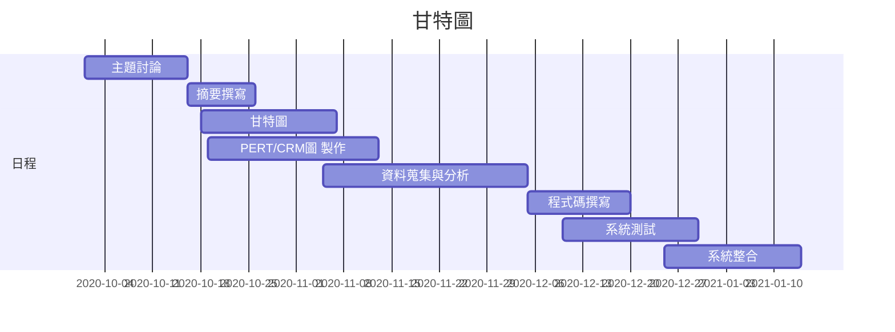

## 2020_OO

## 姓名:呂怡儒  學號:C107118132 班級:資管2A

# 題目: ：人工智能旅遊        

## 組長:呂怡儒

## 小組成員:呂怡儒、許皓鈞、呂昆侖、廖哲平、郭柏成

### 摘要:製作出一款可以自動規劃好旅程，只需要點選想去的地方，自動幫你安排行程，也能從自動安排好的行程隨意更動，並且規劃好交通，即時告知當地天氣狀況，除了行程之外，也會提供附近當地的美食特色資訊，並且提供旅館資訊，以便預訂。

### 工作分配: 
前端：呂怡儒、許皓鈞 
後端：郭柏成、呂昆倫、廖哲平

## 甘特圖

### 甘特圖程式碼

### PERT圖

## 功能性需求

#### (功能的需求主要是在描述系統該做什麼。也就是系統要提供給使用者的服務項目)

##### 1.安排行程及路線
##### 2.計算交通費用
##### 3.提供天氣預報
##### 4.美食推薦
##### 5.住宿預訂服務

## 非功能性需求

#### (非功能的需求是指跟系統的執行效率，效能之需求，而且是可以量度的(measurable)的項目)       待完成!!!!!!

##### 反應時間(response time) ：當輸入景點或地區時，就能在2-3秒內顯示系統搜尋到的相關內容。 
##### 使用性(usability)：輕鬆上手有使用過旅遊相關APP都能馬上了解使用方式。 
##### 可靠度(reliability)：失敗率低，地點周邊10m-40km都能搜尋的到。 
##### 效能(performance)：一次能查兩個地點的資訊已出發地以及目的地周邊所有屢有相關資料。 
##### 維護性(maintainability)：會比照網路口碑及打卡留言來篩選出更加優質得行程來減少地雷景點或美食的出現。

## 功能分解圖(FDD)

## 需求分析
### 人工智能旅遊系統的需求分析簡述如下：
 ### (1)使用者可以透過該系統了解交通、天氣、住宿、當地美食等相關訊息
### (2)管理者可以透過使用者提供的目的地及交通方式，透過後台人工智能模型，結合天氣預報、三鐵的交通資訊來提供完整的交通路線及費用的管理
### (3)系統可以提供住宿及當地美食的推薦及相關資訊，可結合在地餐廳及民宿，透過宣傳增加在地的觀光及美食曝光度，但須跟店家做配合，查詢店家資訊以及避免使用者體驗下降
### (4)管理者依照不同的季節、節日、時間來修改後台數據提供最準確的資訊
### (5)不主動要求使用者填寫資料並保存，只向使用者提供經過檢視的資訊供使用者參考及使用
## 使用案例說明

## 使用案例圖

## 系統環境圖

## DFD 圖0

## 範例一循序圖

## 範例一活動圖

## UML圖

