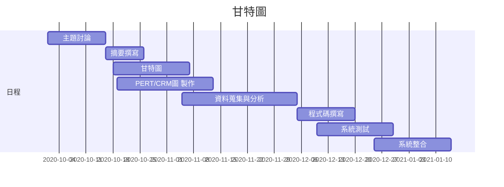

## 2020_OO

## 姓名:呂怡儒  學號:C107118132 班級:資管2A

# 題目: ：人工智能旅遊        

## 組長:呂怡儒

## 小組成員:呂怡儒、許皓鈞、呂昆侖、廖哲平、郭柏成

### 摘要:製作出一款可以自動規劃好旅程，只需要點選想去的地方，自動幫你安排行程，也能從自動安排好的行程隨意更動，並且規劃好交通，即時告知當地天氣狀況，除了行程之外，也會提供附近當地的美食特色資訊，並且提供旅館資訊，以便預訂。

### 工作分配: 
前端：呂怡儒、許皓鈞 
後端：郭柏成、呂昆倫、廖哲平

##甘特圖

###甘特圖程式碼

###PERT圖

