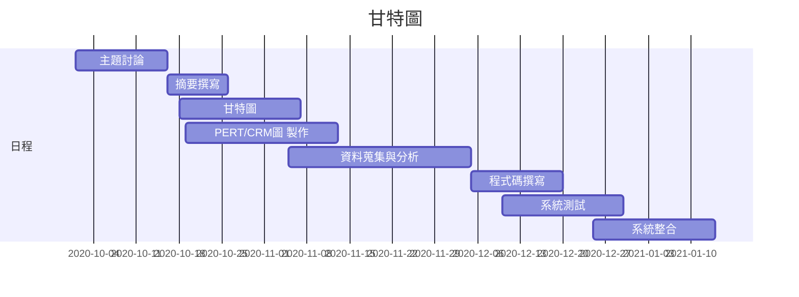
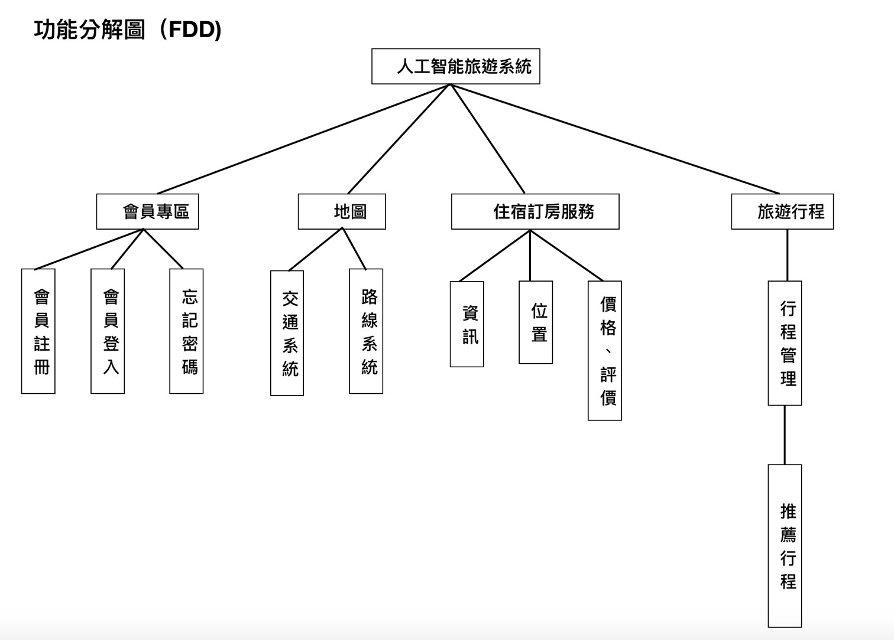
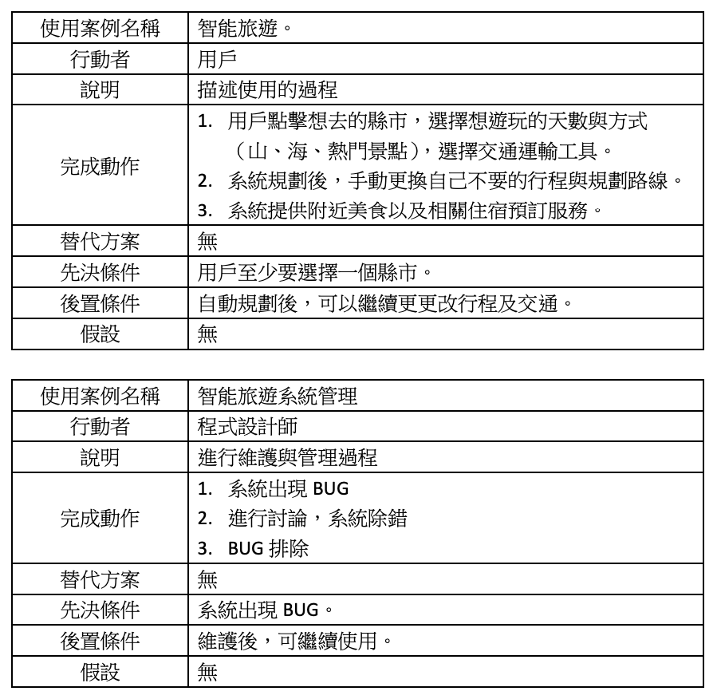
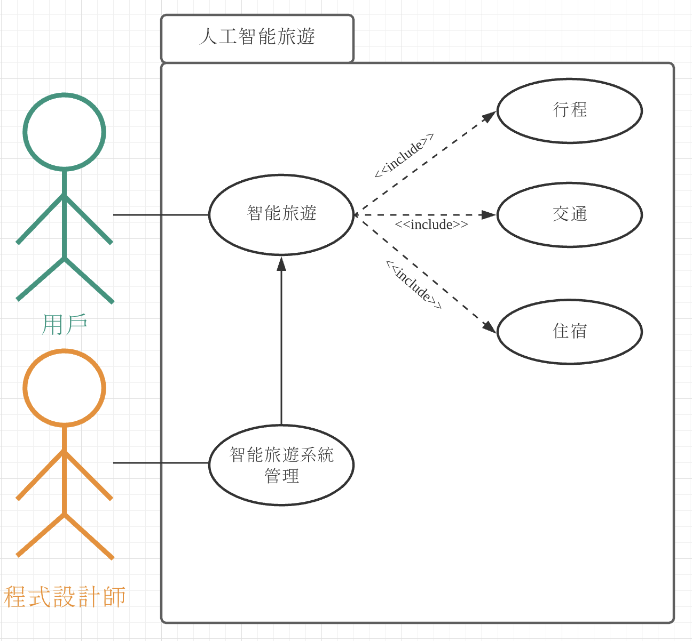
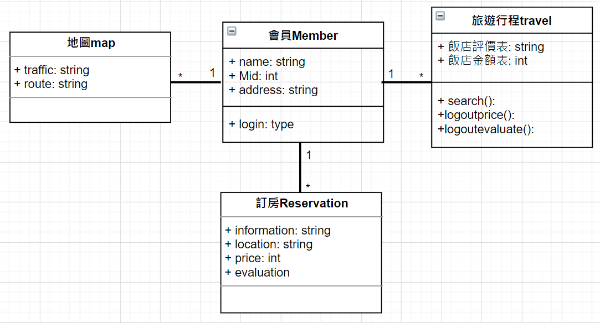
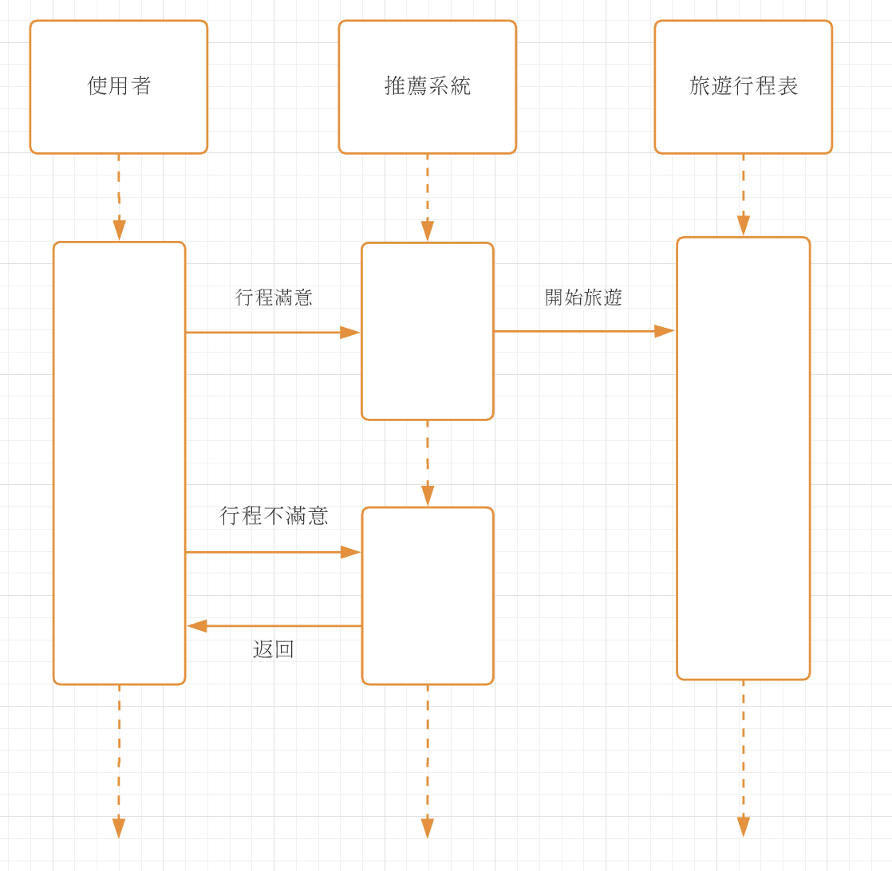
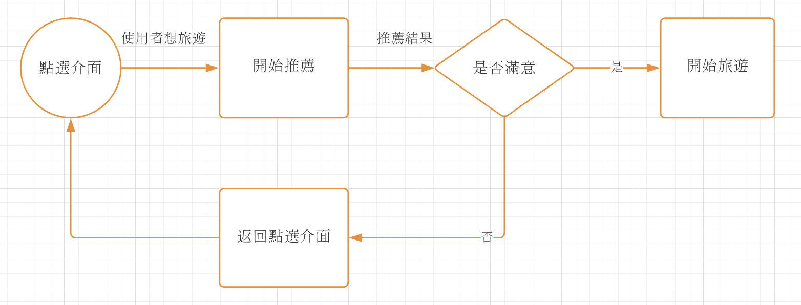
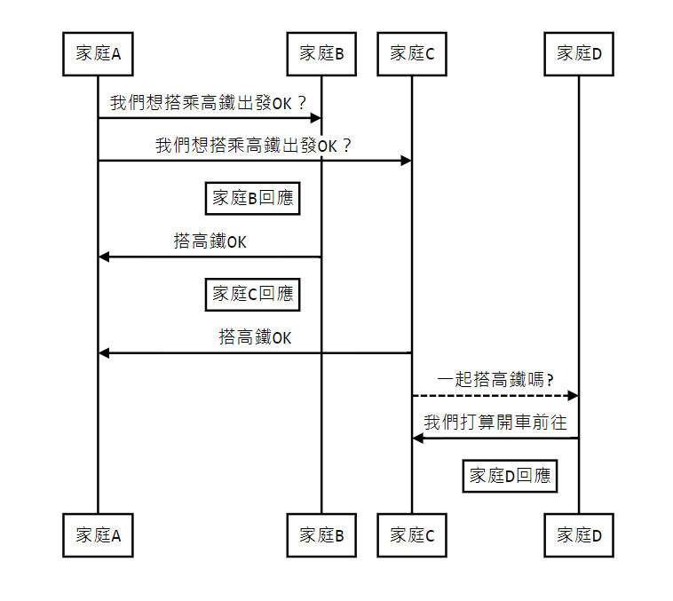
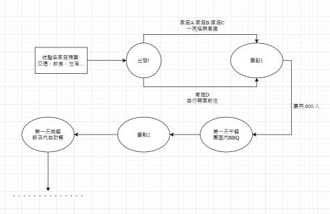

## 2020_OO

## 姓名:呂怡儒  學號:C107118132 班級:資管2A

# 題目: ：人工智能旅遊        

## 組長:呂怡儒

## 小組成員:呂怡儒、許皓鈞、呂昆侖、廖哲平、郭柏成

### 摘要:製作出一款可以自動規劃好旅程，只需要點選想去的地方，自動幫你安排行程，也能從自動安排好的行程隨意更動，並且規劃好交通，即時告知當地天氣狀況，除了行程之外，也會提供附近當地的美食特色資訊，並且提供旅館資訊，以便預訂。

### 工作分配: 
前端：呂怡儒、許皓鈞 
後端：郭柏成、呂昆倫、廖哲平

## 甘特圖

### 甘特圖程式碼

### PERT圖

## 功能性需求

#### (功能的需求主要是在描述系統該做什麼。也就是系統要提供給使用者的服務項目)

##### 1.安排行程及路線
##### 2.計算交通費用
##### 3.提供天氣預報
##### 4.美食推薦
##### 5.住宿預訂服務

## 非功能性需求

#### (非功能的需求是指跟系統的執行效率，效能之需求，而且是可以量度的(measurable)的項目)       待完成!!!!!!

##### 反應時間(response time) ：當輸入景點或地區時，就能在2-3秒內顯示系統搜尋到的相關內容。 
##### 使用性(usability)：輕鬆上手有使用過旅遊相關APP都能馬上了解使用方式。 
##### 可靠度(reliability)：失敗率低，地點周邊10m-40km都能搜尋的到。 
##### 效能(performance)：一次能查兩個地點的資訊已出發地以及目的地周邊所有屢有相關資料。 
##### 維護性(maintainability)：會比照網路口碑及打卡留言來篩選出更加優質得行程來減少地雷景點或美食的出現。

## 功能分解圖(FDD)

## 需求分析
### 人工智能旅遊系統的需求分析簡述如下：
 ### (1)使用者可以透過該系統了解交通、天氣、住宿、當地美食等相關訊息
### (2)管理者可以透過使用者提供的目的地及交通方式，透過後台人工智能模型，結合天氣預報、三鐵的交通資訊來提供完整的交通路線及費用的管理
### (3)系統可以提供住宿及當地美食的推薦及相關資訊，可結合在地餐廳及民宿，透過宣傳增加在地的觀光及美食曝光度，但須跟店家做配合，查詢店家資訊以及避免使用者體驗下降
### (4)管理者依照不同的季節、節日、時間來修改後台數據提供最準確的資訊
### (5)不主動要求使用者填寫資料並保存，只向使用者提供經過檢視的資訊供使用者參考及使用
## 使用案例說明

## 使用案例圖

## 系統環境圖

## DFD 圖0

## UML圖

# 使用案例
## 案例1.外國訪客來國自由行
網路上的推薦指南凌亂，不同地區當地的交通也有所不同，出境後如難透過網路上得到最完整的旅遊資訊，因此可以透過智能旅遊系統得到完整的解答，透過加入會員後，點選想去的城市，並且透過系統自動推薦行程及在地美食及景觀，並且提供手動更改行程的功能，可將時間有衝突或不感興趣的行程做刪除，系統也會記錄下刪除的原因，可用於未來再次使用時的推薦改善。假設外國旅客來台自由行時，選定地點在古色古香的台南，但出了台南火車站後卻無法有效的找到自己想吃的美食及想逛的景點，即便敲定了選項，也難以順利地找到公車或相關交通訊息，而此時智能旅遊系統將會提供交通的推薦，不只一般的公車，甚至到叫車服務及租賃機車也可以做相關的設計及合作，也提供相對穩定且不易出錯的翻譯系統給外國旅客使用，避免文化的差異導致了旅途的不愉快。
### 循序圖

### 活動圖

## 案例2.跨縣市旅遊
網路上充斥著各式各樣的App提供各個地方的美食、景點，但往往只會有單一項目的產生，例如：美食只會推薦食物且容易受到廣告置入的影響、交通查詢系統只提供交通卻無完整規畫相關行程容易導致時間不好配合等．．．。假設身在高雄的大學生們來到了台東畢業旅行，往往都要手動去查詢火車班次、租車行比較、民宿、景點、美食等等各種不同的細項規劃，但如果使用智能旅遊系統的輔助，點擊地點、人數、景點、美食等這些不同細項，再選擇交通工具，並且依照團體內不同的習慣及預算，手動刪除或加選需要的項目，不只有美食跟景點，包含民宿、交通等通通可以手動作更改，並且可以提供多樣不同的行程規劃供選擇，透過這項舉動可以讓系統紀錄下使用者的使用體驗及使用習慣，將來的推薦行程將會更符合使用者需求。
### 循序圖

### 活動圖

## 案例3.家族旅遊
家族旅遊最常遇到的問題就是不同的家族會有不同個家庭組成，在這之中每個人的飲食習慣、住宿要求、行程要求皆有不同，相比朋友旅遊，家族旅遊讓大家都滿意的要求便會降地，因此特地針對家族旅遊的相關案例做出系統修正。假設該家族由４個家庭組成，若只單一針對某一家庭的需求做行程規劃，會使得其他家庭有意見分歧的產生，因此在家庭旅遊這塊，提供家庭帳號可供家族做選擇，將４個家庭不同的交通方式、預算、飲食習慣、住宿要求等等細項做結合，經由後來統整及設定，找出相對適合多數家庭的行程來做安排，並且了解各個家庭的人員分配，在挑選住宿及飲食上更貼切使用者的方便與安全性，提供適合整個家族大多數人皆可接受的行程規劃。
### 循序圖

### 活動圖

## 輸入欄位設定

