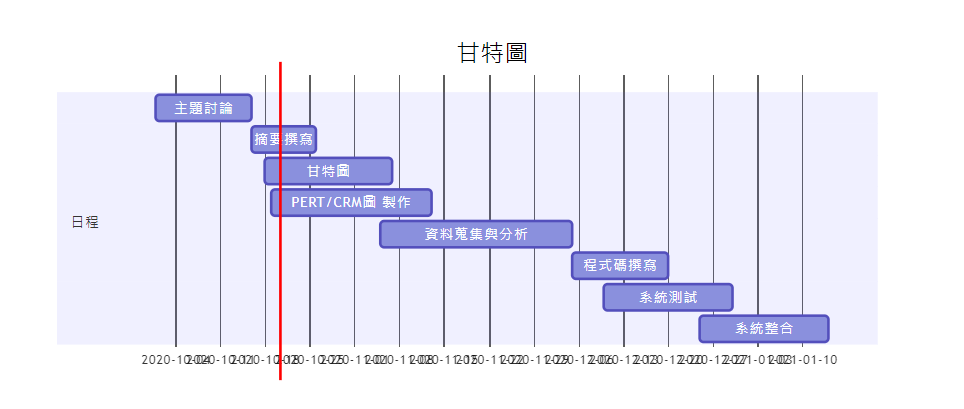
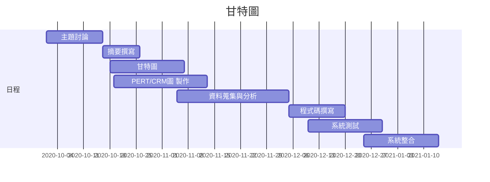
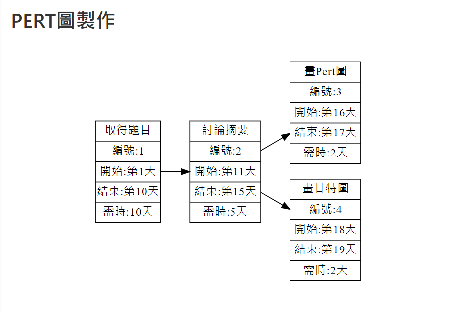

## 2020_OO

## 姓名:呂怡儒  學號:C107118132 班級:資管2A

# 題目: ：人工智能旅遊        

## 組長:呂怡儒

## 小組成員:呂怡儒、許皓鈞、呂昆侖、廖哲平、郭柏成

### 摘要:製作出一款可以自動規劃好旅程，只需要點選想去的地方，自動幫你安排行程，也能從自動安排好的行程隨意更動，並且規劃好交通，即時告知當地天氣狀況，除了行程之外，也會提供附近當地的美食特色資訊，並且提供旅館資訊，以便預訂。

### 工作分配: 
前端：呂怡儒、許皓鈞 
後端：郭柏成、呂昆倫、廖哲平

##甘特圖

###甘特圖程式碼

###PERT圖

##功能性需求
####(功能的需求主要是在描述系統該做什麼。也就是系統要提供給使用者的服務項目)

1.安排行程及路線
2.計算交通費用
3.提供天氣預報
4.美食推薦
5.住宿預訂服務

##非功能性需求
####(非功能的需求是指跟系統的執行效率，效能之需求，而且是可以量度的(measurable)的項目)

反應時間(response time) ：對於使用者所觸發之事件的執行所將花費之時間。 
使用性(usability)：描述對於一個正常的使用者所需之訓練時間。 
可靠度(reliability)：可靠度可包含許多要項，最常見的是描述系統的失敗率。 
效能(performance)：效能可包含許多要項，最常見的是描述系統在每秒鐘可以處理的交易量。 
維護性(maintainability)：描述任何可以增進系統維護之相關項目，例如編碼的準則，命名的標準等。

